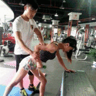
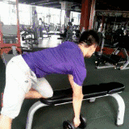
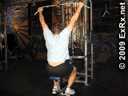
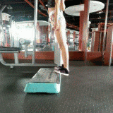

# 健身房常见健身器材的使用说明
下面给大家带来一套很全的锻炼图解，身体的几大块肌肉群都可以练到。动作给你了，练就靠你自己了。
## 肩部、三角肌
- 器械推肩

- 哑铃侧平举

- 反式蝶机展肩

- 坐姿哑铃推举

- 杠铃立正划船

-哑铃前平举

- 拉力器前平举

- 拉力器侧平举

- 拉力器俯身侧平举

- 拉力器立正划船

> 功效：
> 1. 改善肩部形体 肩窄溜肩穿衣不好看现象
> 2. 强化肩周，增加肩部功能性，以防肩周疾病产生

## 肱三头肌

拉力器屈臂下压

哑铃颈后臂屈伸

俯身单臂哑铃臂屈伸

窄握双杠臂屈伸

拉力器臂屈伸

> 功效：
> 1. 塑造手臂曲线，紧致手臂肌肤，避免拜拜肉的产生
> 2. 增肌手臂力量及功能性，避免手无缚鸡之力及功能退化
      
 ## 肱二头肌
 
 反握引体向上

哑铃弯举

绳索弯举

杠铃弯举

拉力器弯举

> 功效：
> 1. 塑造手臂曲线，紧致手臂肌肤，避免拜拜肉的产生
> 2. 增肌手臂力量及功能性，避免手无缚鸡之力及功能退化

## 背部肌群

器械高位下拉

哑铃俯身单臂划船

反握高位下拉

坐姿划船

山羊挺身

引体向上

坐姿颈后下拉

站姿直臂下拉

> 功效：
> 1. 改善背部形体，以防圆肩驼背，影响姿态气质
> 2. 加强背部功能性训练，增加脊柱保护，以免产生腰肌劳损，颈椎疾病的产生

## 胸肌

坐姿卧推

跪姿俯卧撑

蝴蝶机夹胸

拉力器夹胸

哑铃平板卧推

直臂夹胸器

史密斯卧推

胸肌臂屈伸

> 功效：
> 1. 上体前侧胸部形体塑造，
> 2. 强化胸部功能性，以防肌肉衰退进程

## 腹肌

器械卷腹

器械扭腰

健身球卷腹

垫上腹部训练

垫上腹部训练

悬垂举腿

仰卧起坐

支撑提臀抬腿

> 功效：
> 1. 塑造腹部形体，减少腰围。
> 2. 强化腹部肌肉及腹部功能性，增加腹部对脏腑器官的保护功能
      
## 腿部肌肉

45°倒蹬机

坐姿腿屈伸

俯身腿弯举

站姿提踵

杠铃或哑铃弓步蹲

史密斯蹲起

站姿髋外展

站姿直腿上摆

坐姿髋外展

> 功效：
> 1. 塑造腿部形体，打造腿部曲线，
> 2. 增加腿部功能性，以防腿部功能衰退进程
